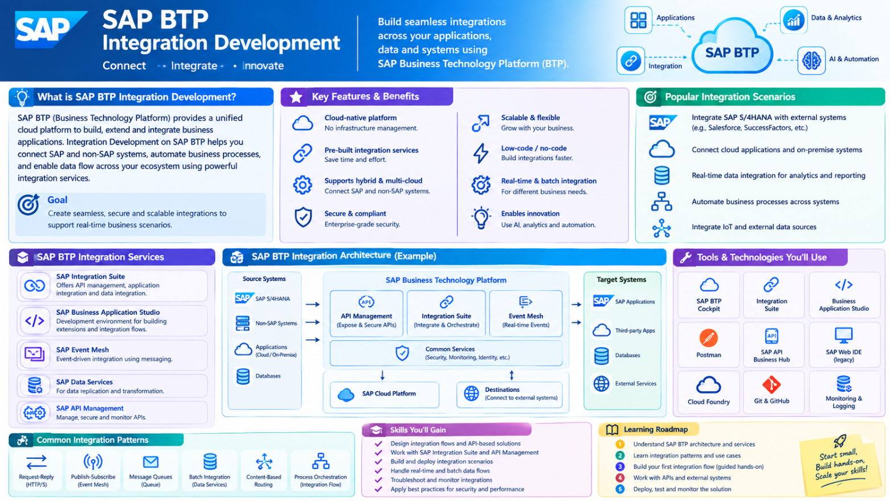
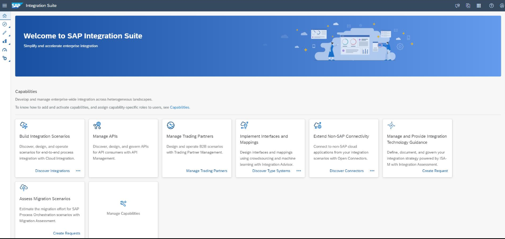
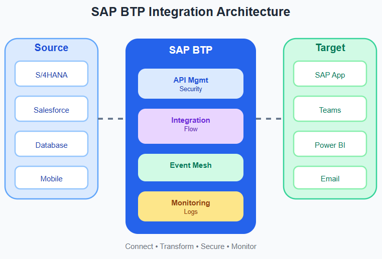
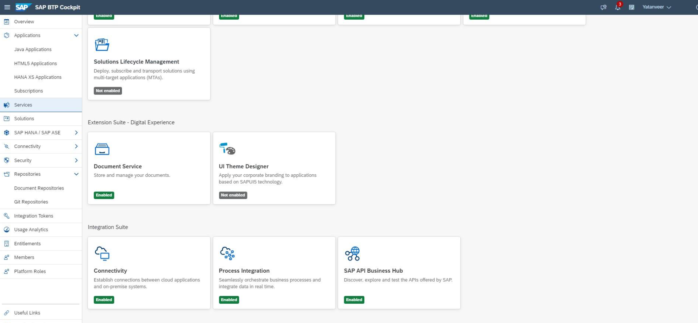
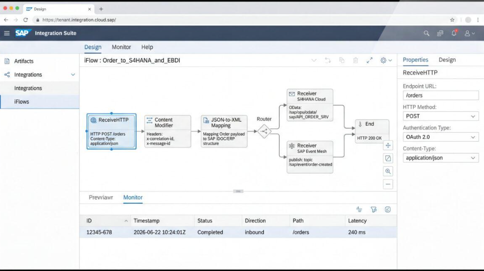
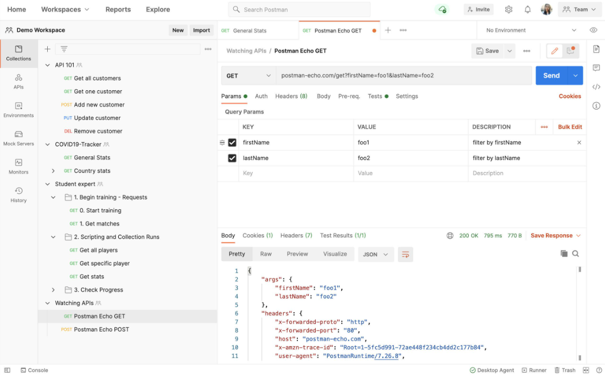
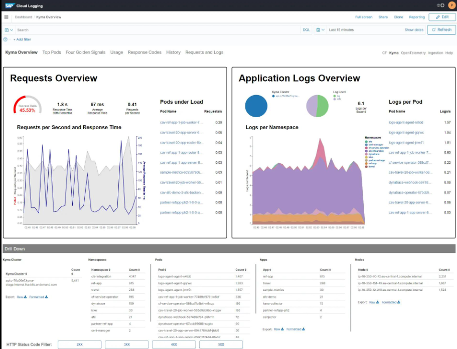
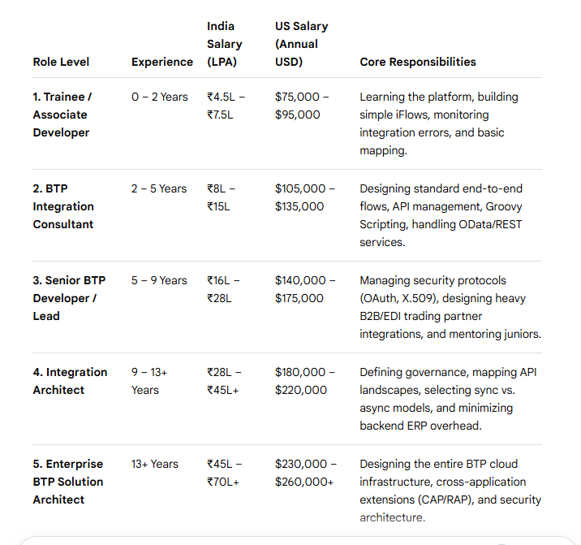
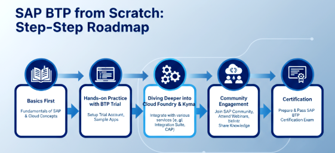

<div class="landing-hero">
  <div class="hero-copy">
    <span class="eyebrow">SAP BTP Integration Development</span>
    <h1>Build enterprise-ready integrations that connect business systems.</h1>
    <p>
      Learn how SAP BTP Integration Suite helps organizations connect SAP and non-SAP applications, automate business workflows, and secure digital communication across the enterprise.
    </p>
    <div class="hero-actions">
      <a href="#stream-guide" class="primary-btn">Stream Guide</a>
      <a href="#stream-course" class="secondary-btn">Stream Course</a>
    </div>
    <div class="hero-highlights">
      <span>Beginner Friendly</span>
      <span>Cloud Integration</span>
      <span>API & Security</span>
    </div>
  </div>
  <div class="hero-visual">
    
  </div>
</div>

<a id="stream-guide"></a>

## Stream Guide

### Role Overview

A SAP BTP Integration Developer designs and builds secure cloud integrations that allow SAP and non-SAP applications to exchange data automatically, reliably, and in real time. This role sits at the intersection of middleware, APIs, transformation logic, monitoring, and enterprise security.

<div class="info-grid">
  <div class="info-card">
    <h3>What this role does</h3>
    <p>Connect business systems such as SAP S/4HANA, SuccessFactors, Salesforce, web applications, and internal services so they exchange data without manual effort.</p>
  </div>
  <div class="info-card">
    <h3>Core responsibilities</h3>
    <p>Design integration flows, build APIs, transform data, enforce security policies, and monitor failed transactions for stable business operations.</p>
  </div>
  <div class="info-card">
    <h3>Why it matters</h3>
    <p>Modern businesses depend on connected systems. Integration developers help the data move securely, fast, and consistently across platforms.</p>
  </div>
</div>

## First, what does this role actually do?

Imagine a company like Amazon or Reliance uses 20 different software systems:

| System | Function |
| --- | --- |
| HR | SuccessFactors |
| Finance | SAP S/4HANA |
| Sales | Salesforce |
| Email | Outlook |
| Customer App | Mobile Application |

These systems don't automatically talk to each other.

**SAP BTP Integration suite (APIs, Security, Events) = build the bridges that connect HR system, Finance, Salesforce, Mobile App**

**Our Job:** Design, build, test, and monitor these integrations.

## What is SAP?

SAP is one of the world's largest enterprise software companies. It provides software that businesses use to manage operations, transactions, supply chains, and customer processes.

- SAP S/4HANA: Finance, procurement, inventory
- SuccessFactors: HR and employee management
- SAP Ariba: Supplier and purchasing
- SAP Analytics Cloud: Business intelligence and reporting

> Think of SAP as the operating system for large businesses.

## What is BTP?

BTP = Business Technology Platform. It is SAP's cloud platform where developers build applications and integrations. Instead of installing software on company servers, everything runs in the cloud.

### BTP has four pillars

- Integration (Connect SAP and Non-SAP systems)
- Application Development (Build cloud applications)
- Data & Analytics (Process and analyze business data)
- AI & Automation (Intelligent workflows)

Our stream focuses mainly on the Integration pillar.

## What is Integration?

Integration simply means making two systems communicate.

```text
HR (Employee created) --> SAP BTP (Integration Flow) --> Payroll (Auto Updated)
```

**Without integration:**

- HR team enters employee data.
- Payroll team manually enters it again.
- Errors happen.

**With SAP BTP:**

- HR creates employee.
- SAP BTP automatically sends data.
- Payroll updates instantly.

This automation is your work.

## Welcome to SAP Integration suite



It provides ready-made tools for connecting applications and orchestrating secure business flows across systems.

**Components:**

- Cloud Integration: Build integration flows
- API Management: Create and secure APIs
- Event Mesh: Real-time event communication
- Open Connectors: Connect third-party apps

Think of it as Visual Studio Code + Postman + Middleware combined.

## Your daily responsibilities

1. Design integration flows to decide how data moves between systems.
2. Build secure APIs for applications and digital services.
3. Transform data between XML and JSON, map fields, and validate payloads.
4. Secure integrations using OAuth, API keys, authentication, and encryption.
5. Monitor and troubleshoot failures using logs and retry strategies.

## SAP BTP Integration Architecture



**Step-by-step:**

1. Data comes from SAP or an external system.
2. API receives the request.
3. Integration flow processes it.
4. Data is transformed.
5. Security is applied.
6. Target system receives clean data.

## Technologies you'll learn

- SAP BTP (Cloud Platform)
- Integration Suite (Middleware development)
- REST APIs (System communication)
- JSON / XML (Data formats)
- OAuth 2.0 (Authentication)
- Git & CI/CD (Version Control)

## What is an Integration Flow (iFlow)?

An iFlow is the heart of SAP Integration Suite.

```text
Sender -> API -> Transform -> Route -> Receiver
```

**Example:**

```text
Employee Created -> Receive API Request -> Convert JSON->XML -> Validate Employee ID -> Send to SAP Payroll
```

> Note: No heavy coding initially — many integrations are built visually.

## REST API vs Integration

| REST API | SAP Integration |
| --- | --- |
| Sends data | Connects complete business process |
| One application | Multiple applications |
| Developer builds endpoint | Integration developer orchestrates flow |
| JSON | JSON + XML + Mapping |

You'll use REST APIs inside integrations.

## Typical fresher project

A realistic Accenture training project looks like this:









### Employee onboarding automation

- Receive employee from HR API
- Validate data
- Transform JSON to SAP format
- Send to S/4HANA
- Send welcome email
- Log every transaction
- Monitor failures

This combines APIs, integration, security, and monitoring.

## Career growth in this stream



### Deep dive into the levels

#### Level 1: Associate Developer (The Learner)

Skills: Basic understanding of SAP Cloud Integration (CPI), XML, JSON, and standard SAP objects like IDocs.

Market Status: Companies hire fresh graduates or cross-train traditional ABAP developers. Pay scales on the lower end but scale rapidly after the first 2 years.

#### Level 2 & 3: BTP Integration Consultant / Senior Lead (The Elite Executor)

Skills: Mastery of the SAP Integration Suite. Proficient in Groovy Script or JavaScript to handle complex data mappings and event-driven flows.

Market Status: Very high demand. Mid-to-senior professionals hold strong leverage because they bridge pure coding and enterprise logic.

#### Level 4 & 5: Integration / Solution Architect (The Strategist)

Skills: Cloud security, global governance, hybrid cloud networking, and custom cloud-native development like CAP.

Market Status: These professionals connect the entire corporate infrastructure and often command premium senior positions.

## SAP BTP from scratch step-by-step roadmap



## Top free SAP BTP resources

- SAP BTP Trail Account: https://www.sap.com/products/technology-platform.html
- SAP Learning Hub - BTP Edition: https://learning.sap.com/products/business-technology-platform
- SAP Community - BTP Topics: https://pages.community.sap.com/topics/business-technology-platform
- SAP BTP Developer's Guide: https://pages.community.sap.com/topics/business-technology-platform
- SAP BTP Documentation: https://help.sap.com/docs/btp?locale=en-US
- SAP BTP Tutorials: https://developers.sap.com/tutorial-navigator/
- SAP BTP for Beginner: https://community.sap.com/t5/technology-blog-posts-by-sap/explaining-sap-business-technology-platform-sap-btp-for-a-beginner-2025/ba-p/13557182
- SAP BTP Free Tier Model: https://www.sap.com/india/products/technology-platform/pricing.html
- Start Developing in SAP BTP: https://developers.sap.com/tutorials/mission-start-developing-in-sap-btp

## Certifications

- Comprehensive Guide to SAP BTP Certifications: https://community.sap.com/t5/technology-blog-posts-by-sap/a-comprehensive-guide-to-sap-btp-certifications-2025-updated/ba-p/13579419

### Primary certification

SAP Certified Associate - Integration Developer (C_CPI_2506): https://learning.sap.com/certifications/sap-certified-associate-integration-developer

Target Role: Design, build, and deploy integration flows (iFlows) using SAP Integration Suite.

### Advanced certification

SAP Certified Professional - Solution Architecture - SAP BTP (P_BTPA_2408): https://learning.sap.com/certifications/sap-certified-professional-solution-architect-sap-btp

<a id="stream-course"></a>

## Stream Course

### SAP BTP Integration Development with Laxmi Ahuja

[StudyAtLKM Course](https://studyatlkm.accenture.com/enrol/index.php?id=392)

<div class="course-summary">
  <div class="stat-card">
    <span class="stat-number">6</span>
    <span class="stat-label">Learning Modules</span>
  </div>
  <div class="stat-card">
    <span class="stat-number">679</span>
    <span class="stat-label">Hours</span>
  </div>
  <div class="stat-card">
    <span class="stat-number">Beginner</span>
    <span class="stat-label">Level</span>
  </div>
</div>

<div class="course-panel">
  <div class="panel-copy">
    <p><strong>Course Focus:</strong> SAP BTP Integration Suite with practical learning and business use-case-driven configuration.</p>
    <p><strong>Learning Outcome:</strong> Understand APIs, integration flows, monitoring, transport, open connectors, API Management, and SAP Cloud Integration best practices.</p>
  </div>
  <div class="panel-tag">Planning Algorithms configuration & Applications</div>
</div>

### Course objectives

At the end of this course, participants will be able to explain concepts and perform hands-on activities on the following topics:

<div class="topic-grid">
  <div class="topic-card">SAP BTP</div>
  <div class="topic-card">IS</div>
  <div class="topic-card">CF</div>
  <div class="topic-card">SAP CI Overview</div>
  <div class="topic-card">Pre-Package</div>
  <div class="topic-card">SAP CI Connectivity Options</div>
  <div class="topic-card">SAP CI Security</div>
  <div class="topic-card">Monitoring</div>
  <div class="topic-card">Transport</div>
  <div class="topic-card">API Management Overview</div>
  <div class="topic-card">API Management Development</div>
  <div class="topic-card">Policies</div>
  <div class="topic-card">Open Connectors Instances</div>
  <div class="topic-card">Common Resources</div>
  <div class="topic-card">Formulas</div>
  <div class="topic-card">SAP PI/PO</div>
  <div class="topic-card wide">Best Practices for SAP Cloud Integration & API Management</div>
</div>

### Continuous assessment on Mettl

[Continuous Assessment Mettl](https://digitallearning.accenture.com/atci/learn-home/learn/learn-landing?LearningPlan=User%20Group&Name=SAP%20BTP%20Integration%20Development&type=org)

Understand your "changed" proficiency via continuous assessment and advance your learning.

> Note: You have a maximum of 1 attempt available in total for each continuous assessment.

<div class="assessment-grid">
  <div class="assessment-card">
    <span>MCQ1</span>
    <strong>Target Score: 12</strong>
  </div>
  <div class="assessment-card">
    <span>MCQ2</span>
    <strong>Target Score: 18</strong>
  </div>
  <div class="assessment-card">
    <span>Capstone</span>
    <strong>Target Score: 24</strong>
  </div>
  <div class="assessment-card">
    <span>HON</span>
    <strong>Target Score: 60</strong>
  </div>
</div>

