# Day 10: SAP Cloud Integration Pre-Packaged Content

**Module:** Module 6

## Unit 1: SAP Cloud Integration Pre-Packaged Content

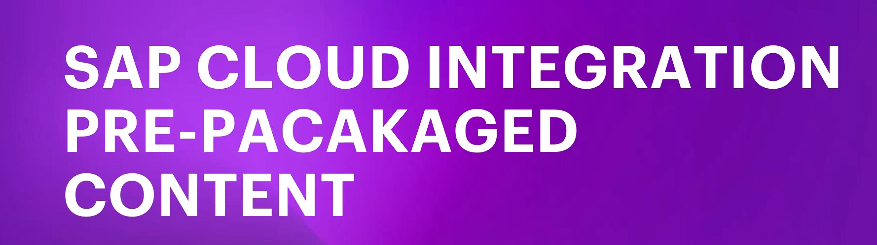

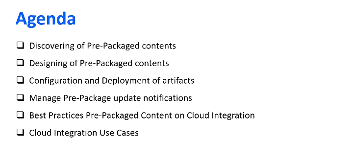

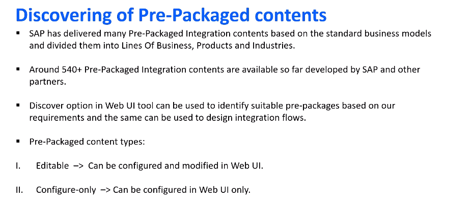

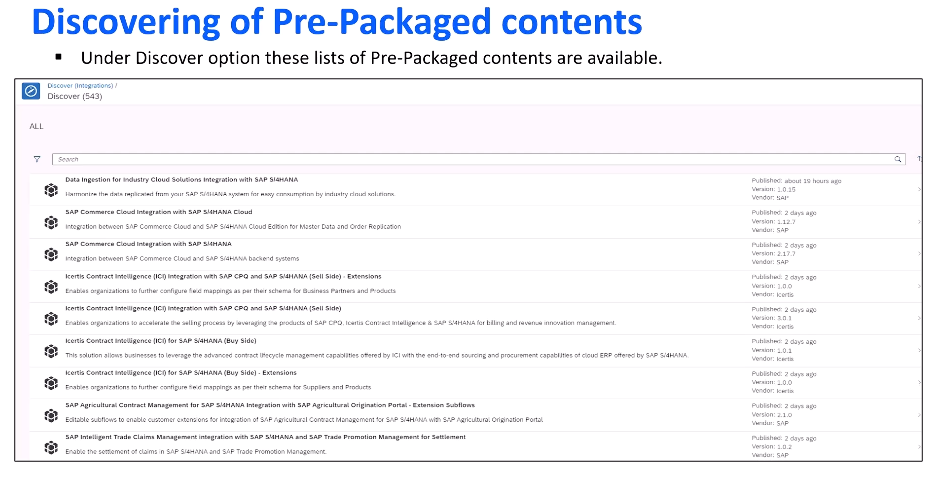

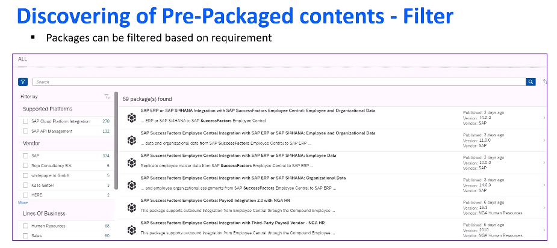

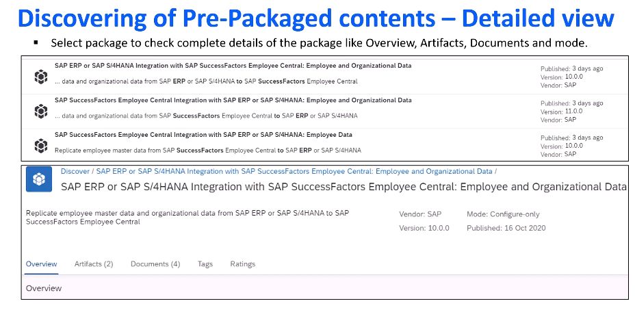

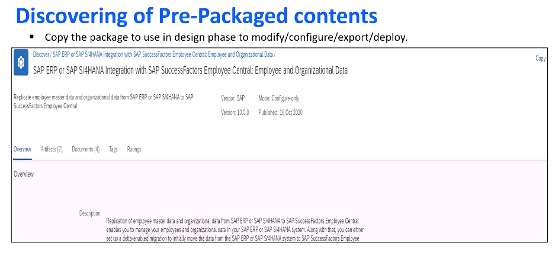

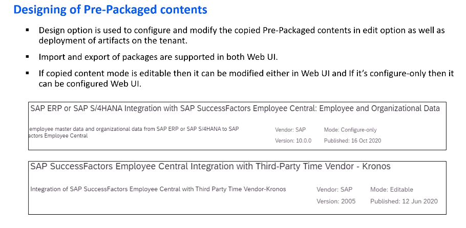

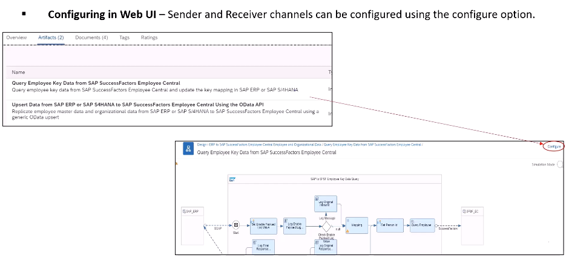

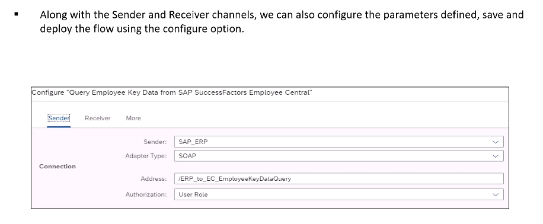

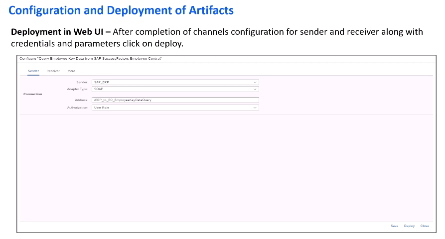

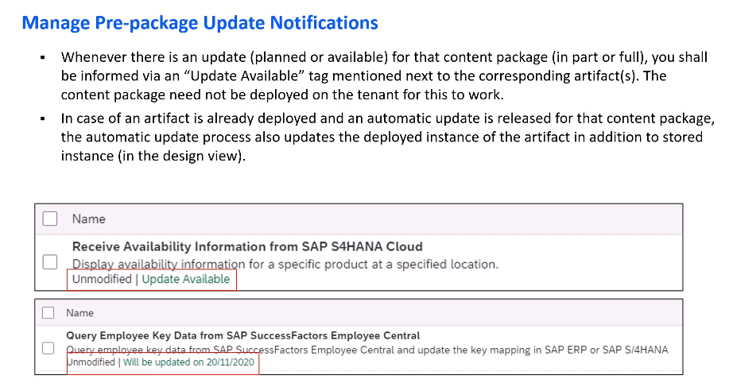

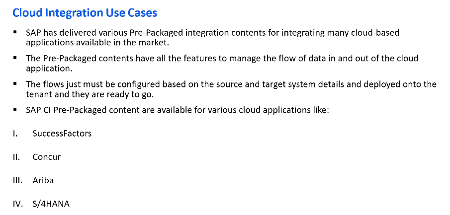

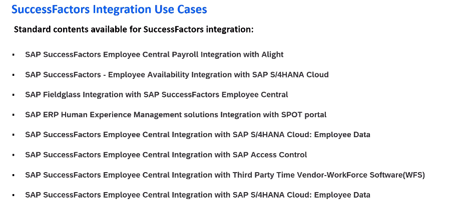

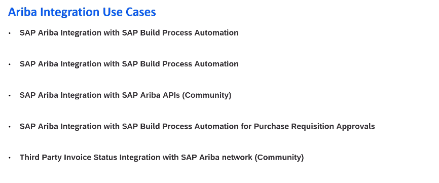

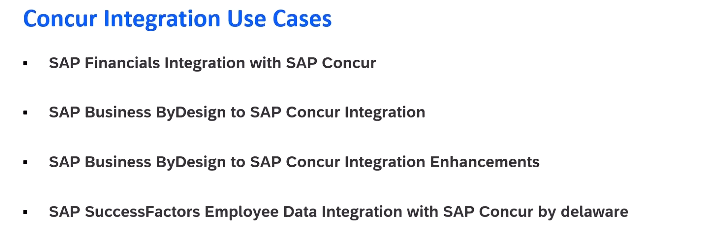

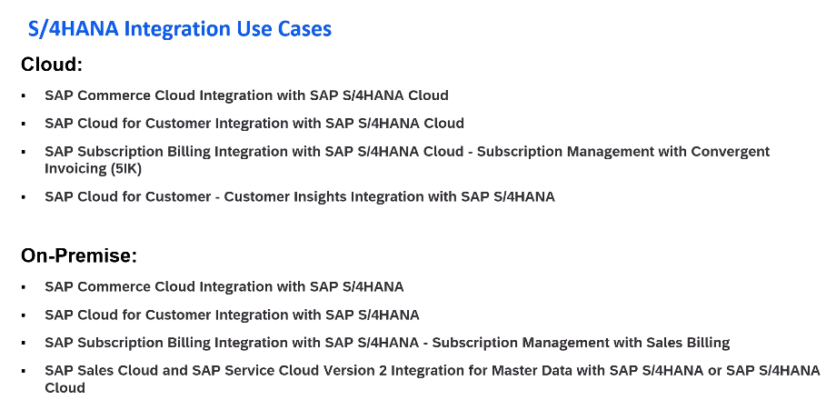

## Unit 2: Cloud Integration Pre-Packaged Content Overview Demonstration

- Learning activity: [Cloud Integration Pre-Packaged Content Overview Demonstration](https://studyatlkm.accenture.com/mod/h5pactivity/view.php?id=24681)
