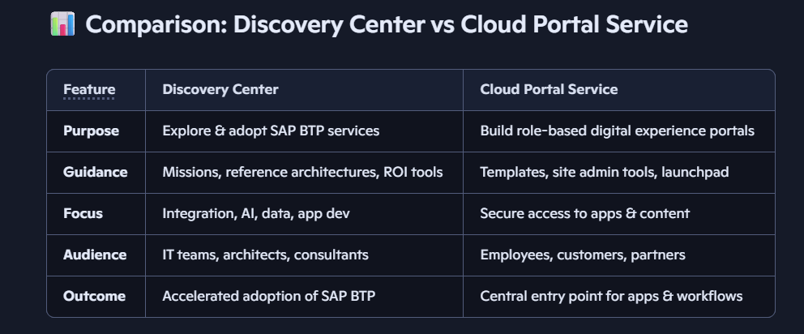
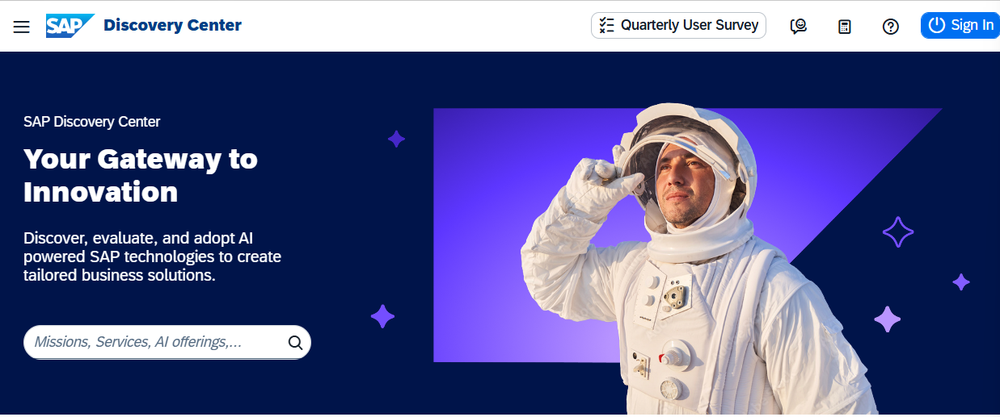
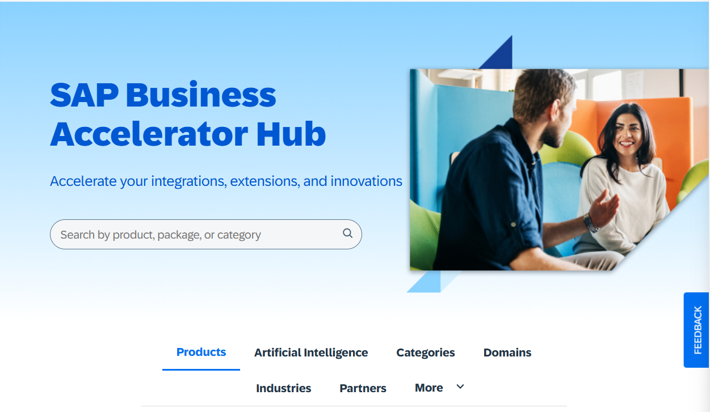

# Day 2: SAP Discovery and Developer Resources

**Date:** 29 September 2026

## SAP Discovery Center

[Open SAP Discovery Center](https://discovery-center.cloud.sap/index.html)

SAP Discovery Center is a self-service portal for exploring SAP BTP services, missions, and use cases. Its guided missions help teams evaluate services and plan implementations.

## SAP Business Accelerator Hub

[Open SAP Business Accelerator Hub](https://api.sap.com)

SAP Business Accelerator Hub is a developer portal for discovering SAP APIs, integration content, and related documentation. Check each API's current documentation for authentication, endpoints, request formats, and rate limits.

### Example OAuth 2.0 authorization-code flow

1. The client app sends the user to the authorization URL with a client ID, scope, and redirect URI.
2. The user signs in and approves access.
3. The authorization server redirects to the client app with an authorization code.
4. The client app exchanges the code at the token endpoint.
5. The client app uses the access token to make authorized API calls.

For an API-specific example, see the [Alpha API documentation](https://alphaapi.sasonline.in/api-docs/).