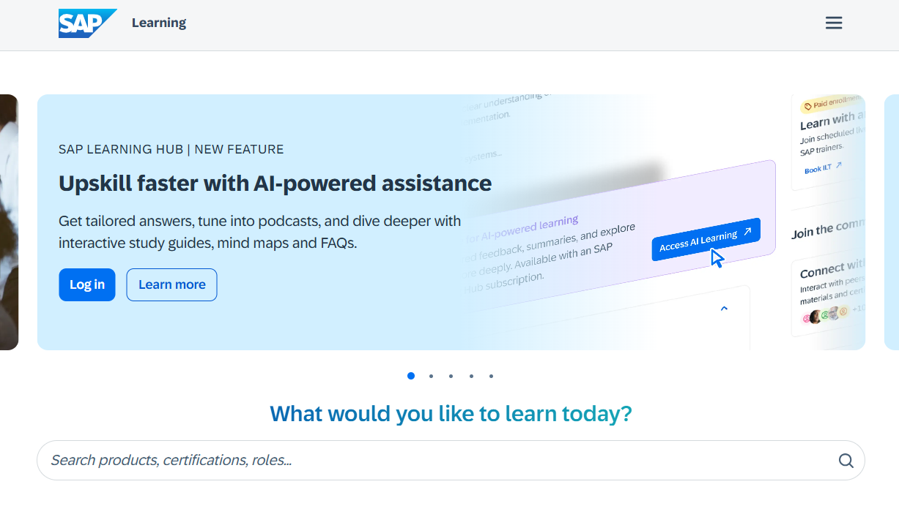
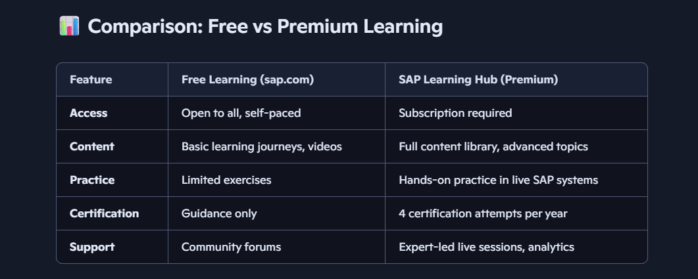
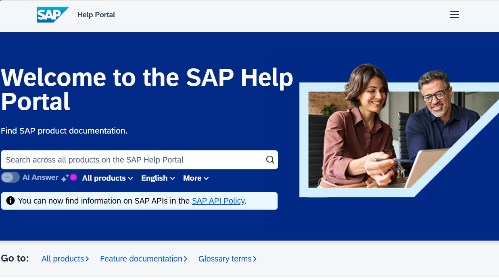
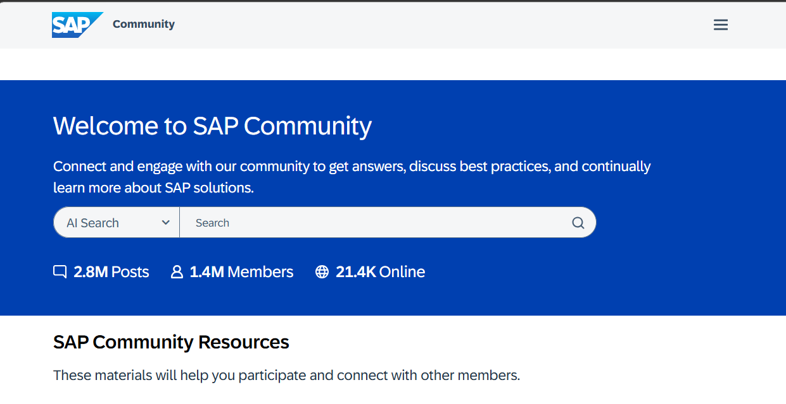

# Day 3: SAP Learning and Support Resources

**Date:** 30 September 2026

## SAP Learning

[Open SAP Learning](https://learning.sap.com)

SAP Learning provides learning journeys, self-paced courses, and certification preparation. Availability of premium learning and hands-on practice depends on the current SAP Learning offering.

## SAP Help Portal

[Open SAP Help Portal](https://help.sap.com/docs)

SAP Help Portal is SAP's documentation source for product guides, API references, and technical instructions. Use documentation for the product and version in your environment.

### Why it matters

- Learn Integration Suite integration-flow patterns.
- Understand API Management policies.
- Follow official troubleshooting steps.
- Prepare for certifications and project work using product documentation.

## SAP Community

[Open SAP Community](https://community.sap.com)

SAP Community is a place for SAP professionals, developers, and learners to ask questions, share knowledge, join groups, and discuss SAP products.

