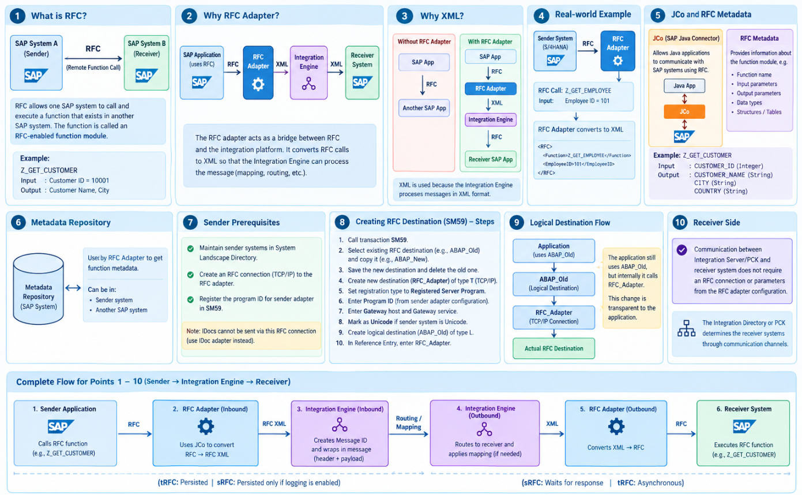
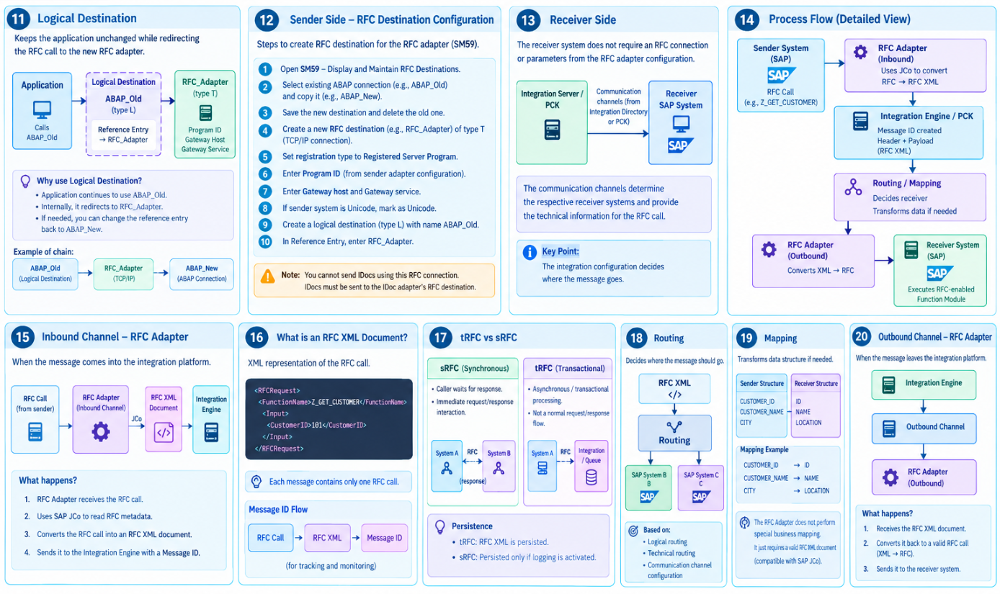
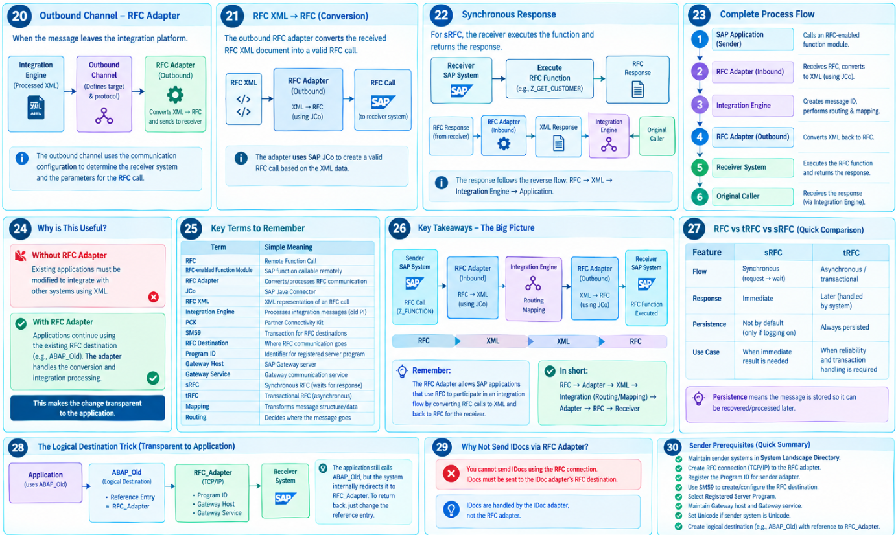
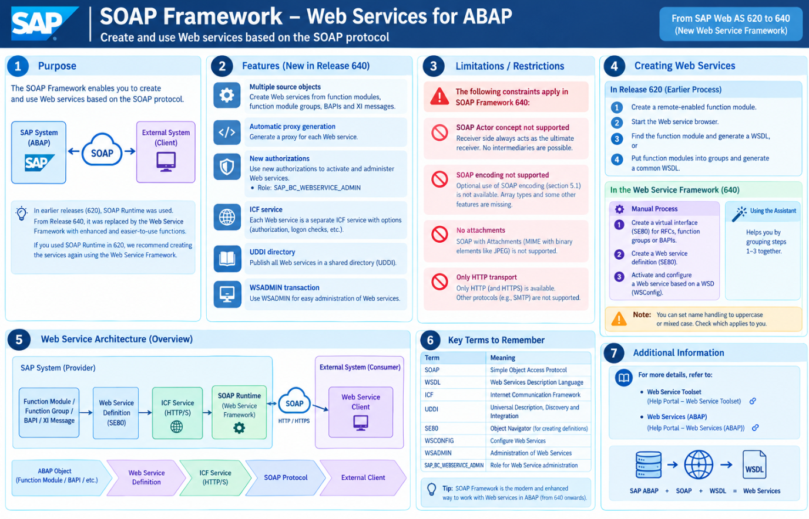
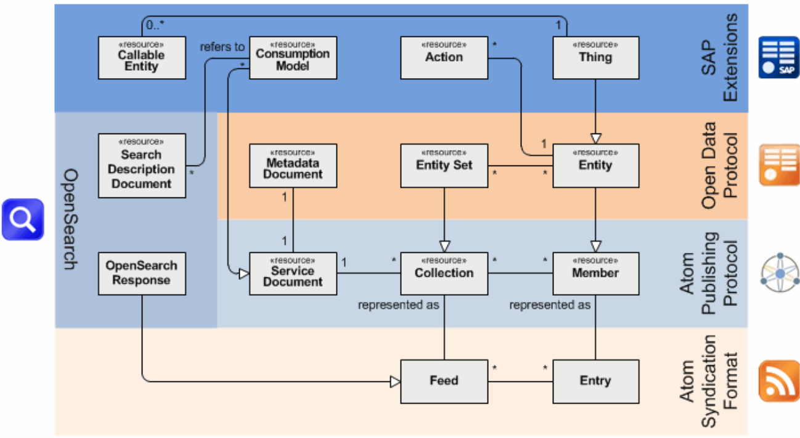
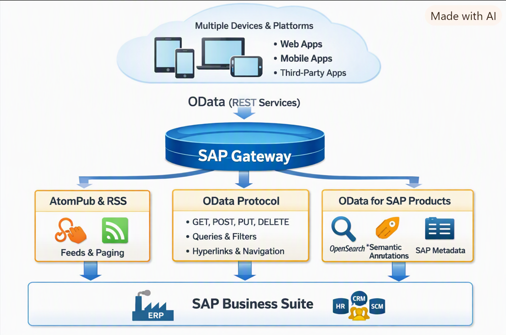
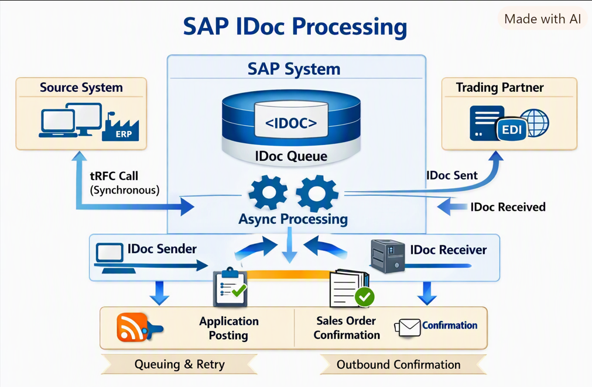
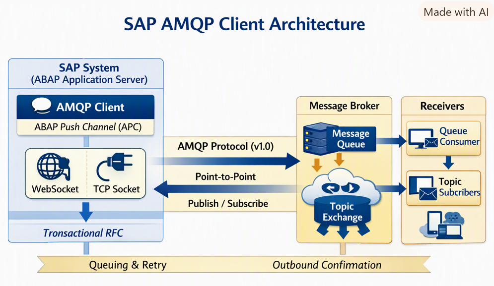

# Day 4: Message Protocols

**Date:** 1 October 2026

Message protocols define how applications exchange requests, responses, or business messages. The protocols below are common in SAP integration landscapes; the choice depends on the systems, data model, and interaction pattern.

## RFC Processing with the RFC Adapter

[SAP Help: RFC Processing with the RFC Adapter](https://help.sap.com/doc/saphelp_snc700_ehp01/7.0.1/en-US/25/76cd3bae738826e10000000a11402f/content.htm?no_cache=true)

Remote Function Call (RFC) lets an SAP system call a function module in another system. In an integration scenario, an RFC adapter can connect an integration flow to SAP RFC-enabled functions. Connectivity, destinations, and authorizations must be configured for the target landscape.

## SOAP Framework

[SAP Help: SOAP Framework and Web Services for ABAP](https://help.sap.com/doc/saphelp_snc700_ehp01/7.0.1/en-US/bb/ddb33d2ae46b3be10000000a114084/content.htm?no_cache=true)

SOAP is a message protocol commonly used with XML-based web services. A service contract, often described with WSDL, defines the operations and message structure. SOAP services may use different bindings and security settings, so follow the service's contract and configuration.

## SAP Gateway and OData

[SAP Help: SAP Gateway and OData](https://help.sap.com/doc/saphelp_nw74/7.4.16/en-us/ec/aeea50ca692309e10000000a445394/content.htm?no_cache=true)

OData is a web protocol for exposing and consuming data through resource-oriented services. Clients address entities and collections using URLs and standard HTTP methods. SAP Gateway can expose SAP data and operations as OData services for web and mobile clients.

## IDoc

[SAP Help: IDoc Processing](https://help.sap.com/saphelp_em700_ehp01/helpdata/en/79/d0b51753406d4d86470debdf027c68/content.htm?no_cache=true)

An Intermediate Document (IDoc) is a structured SAP message format used to exchange business documents between systems. IDocs are commonly processed asynchronously and include a control record and data records organised into segments. Processing status helps track the document through the receiving system.

## AMQP

[SAP Help: AMQP Client Architecture](https://help.sap.com/docs/ABAP_PLATFORM_NEW/05d041d3df1a4595a3c45f57c15e2325/34b187b3d3f04b6fa1c0f0fad15bc064.html?version=202310.003&locale=en-US)

Advanced Message Queuing Protocol (AMQP) is an open messaging protocol for exchanging messages through messaging infrastructure. Producers send messages and consumers receive them through configured destinations such as queues or topics. This decouples the sender and receiver in time and allows each side to process messages independently.

