# Day 9: SAP Cloud Integration Tools and Basic Concepts

**Module:** Module 5

## Unit 1: SAP Cloud Integration Tools and Basic Concepts

### Digital Learning material

- XML Introduction: [XML Introduction](https://developer.mozilla.org/en-US/docs/Web/XML/Guides/XML_introduction)
- XSD Introduction: [XSD Introduction](https://www.w3schools.com/xml/schema_intro.asp)
- WSDL Introduction: [WSDL Introduction](https://www.w3schools.com/xml/xml_wsdl.asp)
- BPMN Introduction: [BPMN Introduction](https://www.bpmn.org/)
- Camel Simple Expression: [Camel Simple Expression](https://blogs.sap.com/2016/11/25/get-to-know-camels-simple-expression-language-in-hci/)

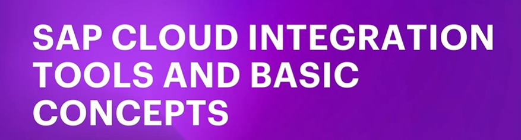

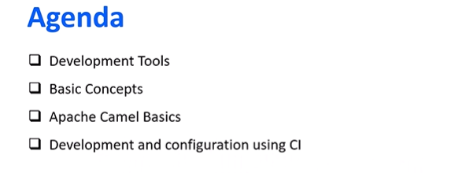

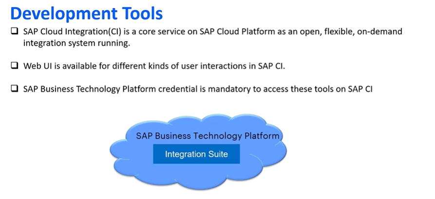

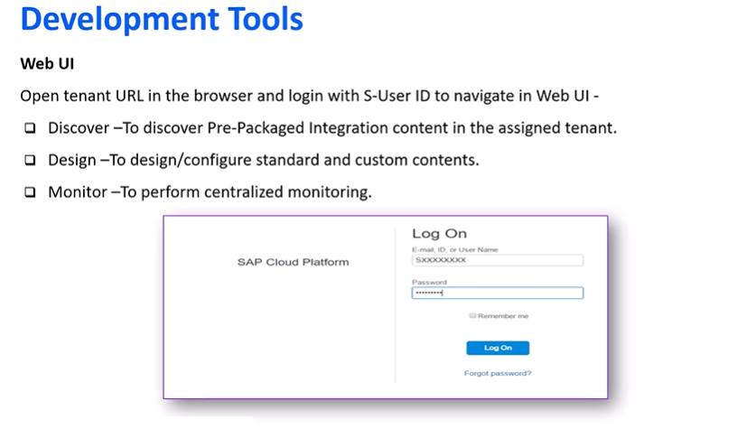

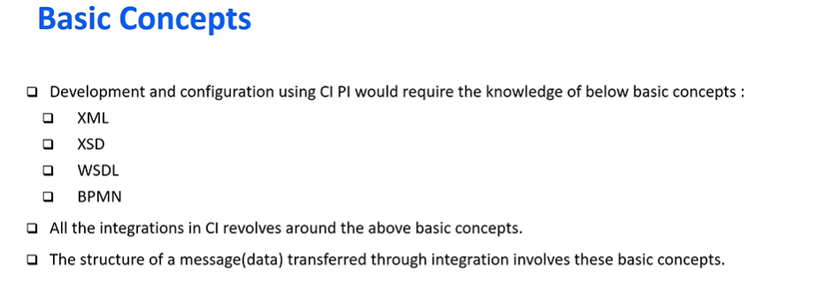

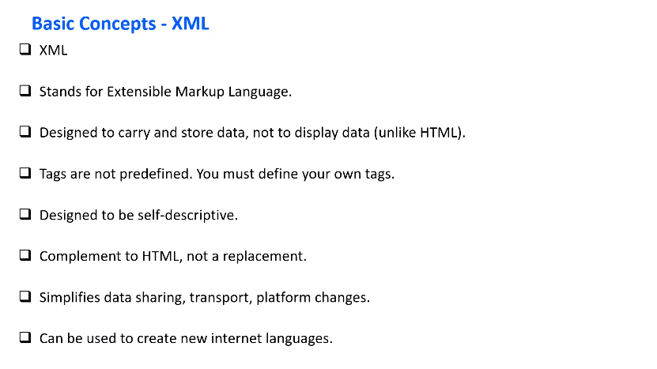

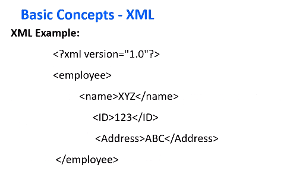

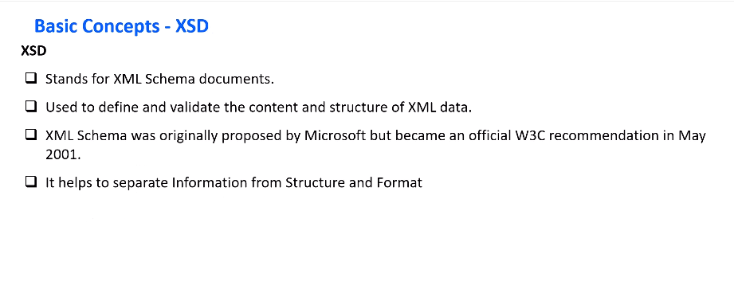

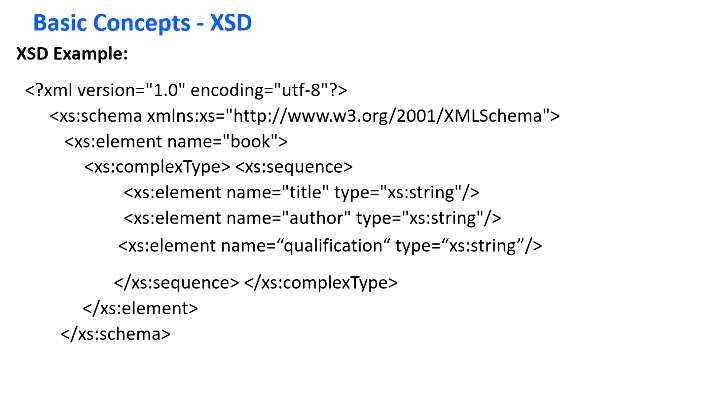

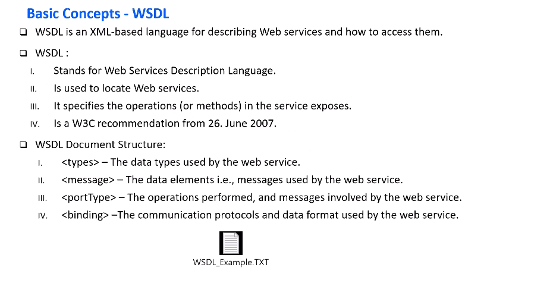

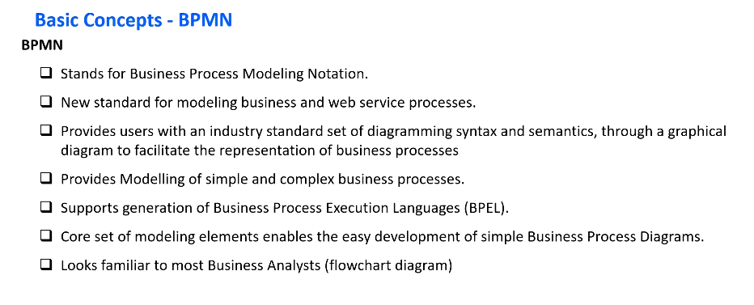

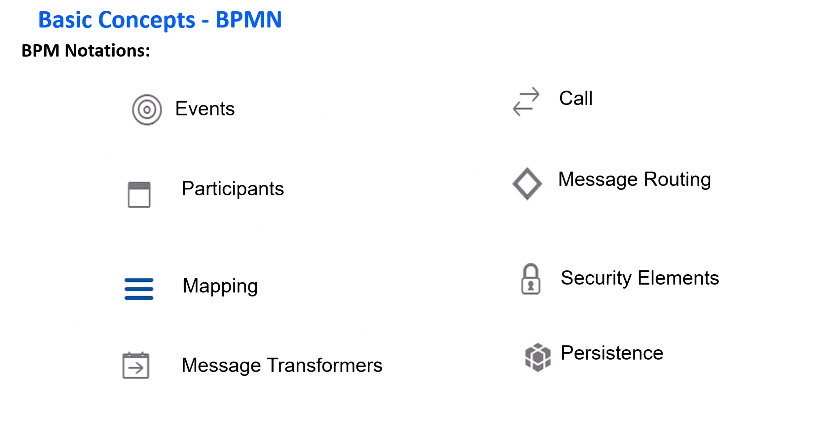

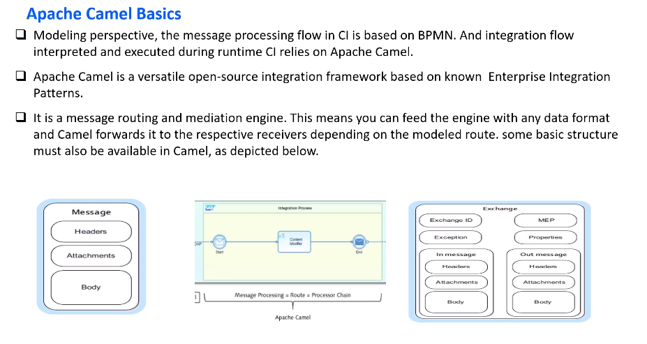

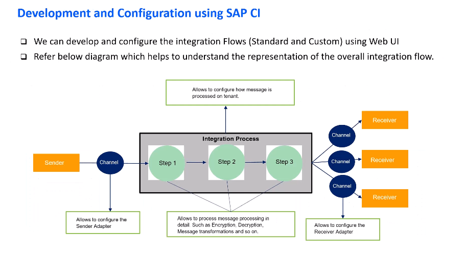

## Unit 2: Integration Package Creation

- Learning activity: [Integration Package Creation](https://studyatlkm.accenture.com/mod/h5pactivity/view.php?id=24678)

## Unit 3: Introduction to SAP Cloud Connector

### Digital Learning material

- SAP Cloud Connector Overview: [SAP Cloud Connector Overview](https://help.sap.com/docs/connectivity/sap-btp-connectivity-cf/cloud-connector)
- Introduction to SAP Cloud Connector: [Introduction to SAP Cloud Connector](https://studyatlkm.accenture.com/mod/h5pactivity/view.php?id=24679)
