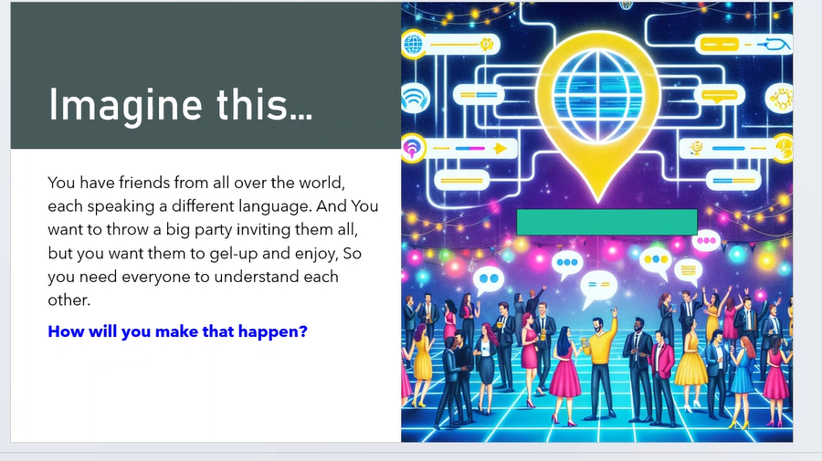
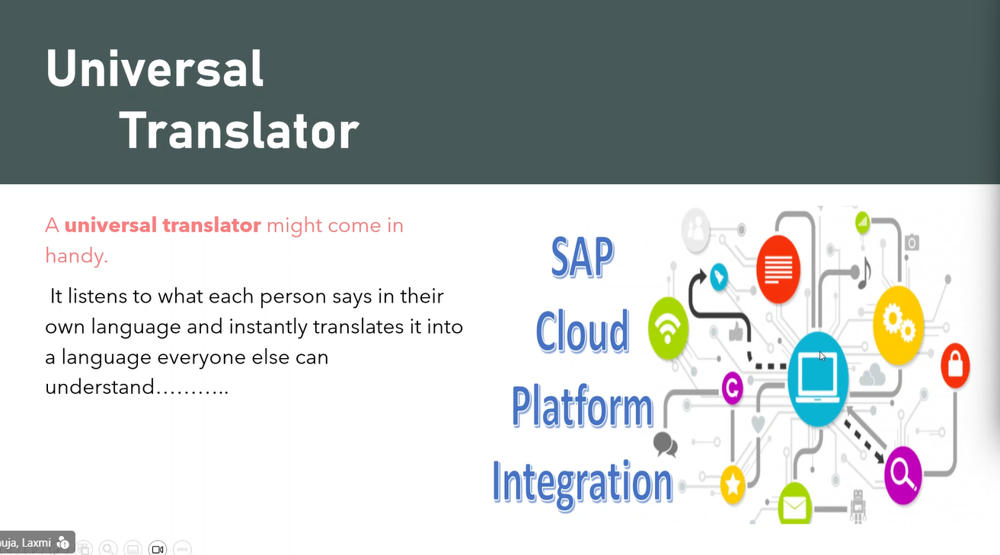
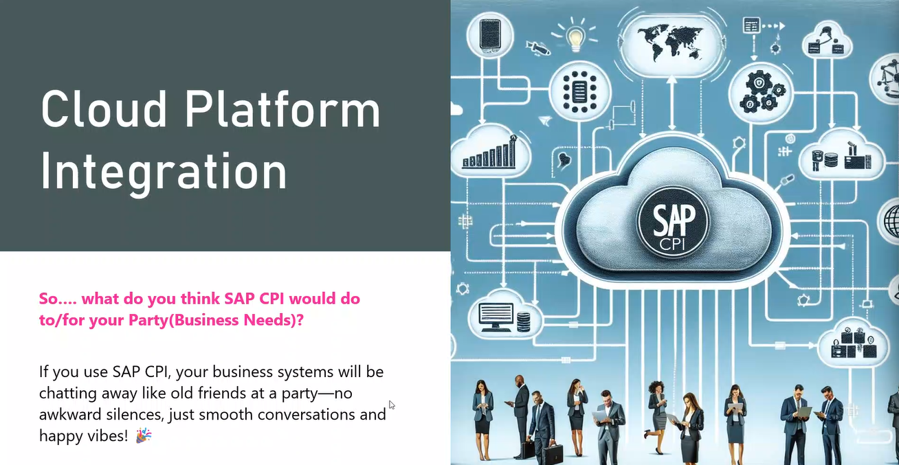
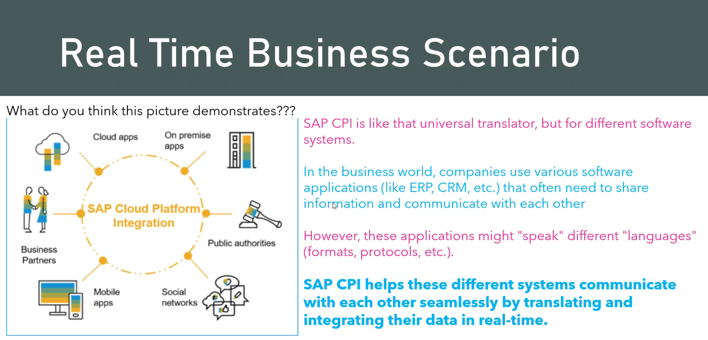
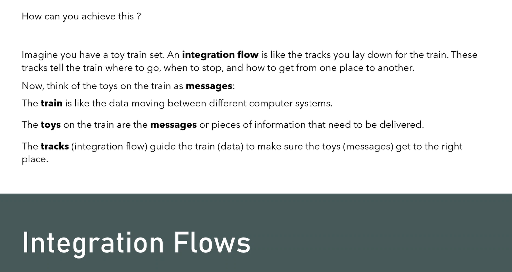
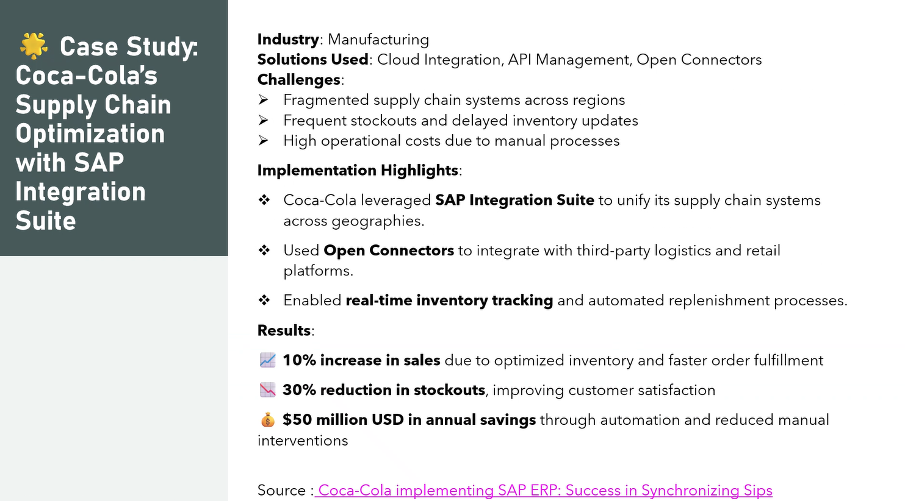
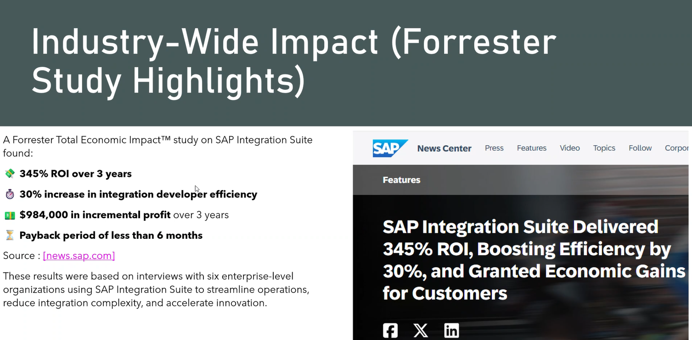

# Scenario-Based Examples: SAP BTP Integration Development

Follow a business scenario from disconnected systems to coordinated processes. These examples show how SAP BTP Integration Suite can connect applications, transform data, and help information reach the right systems at the right time.

