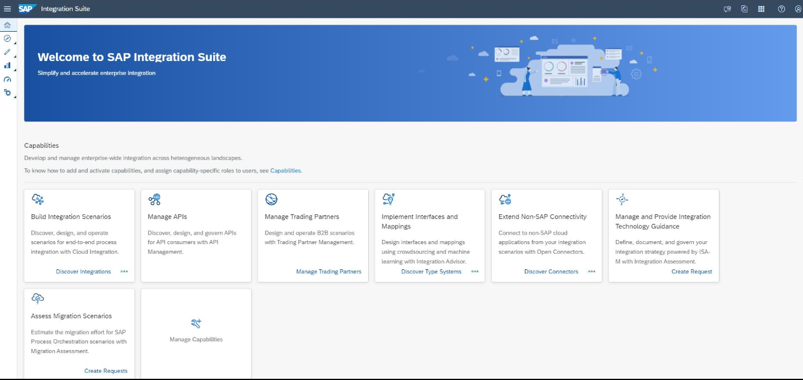
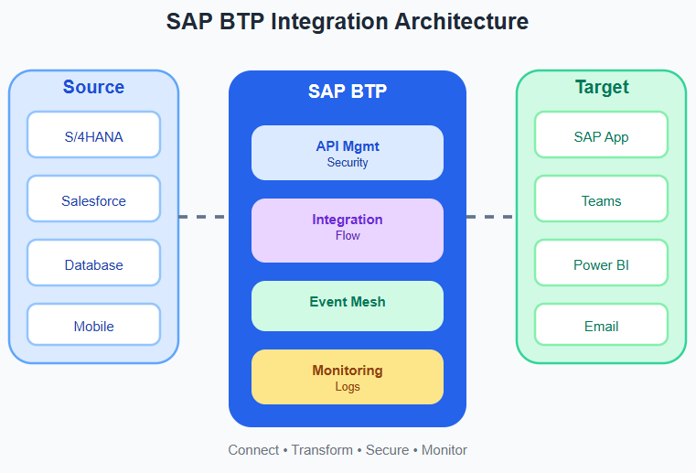
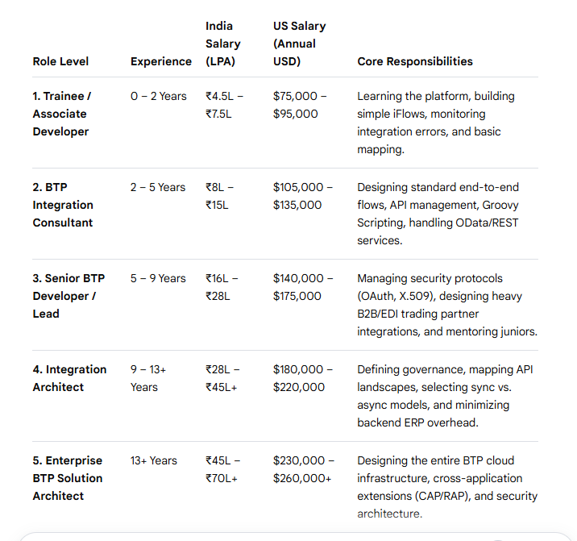
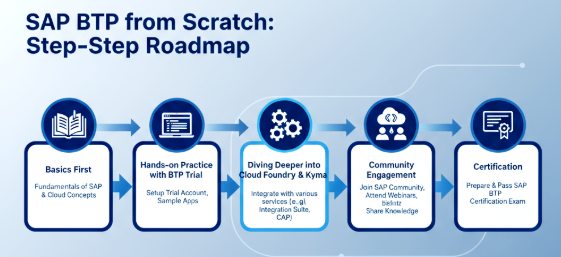

# Stream Guide

## Role Overview

A SAP BTP Integration Developer designs and builds secure cloud integrations that allow SAP and non-SAP applications to exchange data automatically, reliably, and in real time. This role brings together middleware, APIs, transformation logic, monitoring, and enterprise security.

### What this role does

- Connect business systems such as SAP S/4HANA, SuccessFactors, Salesforce, web applications, and internal services.
- Design, build, test, and monitor integrations so systems exchange data without manual effort.
- Transform data, secure APIs, and troubleshoot failed transactions.

## What is SAP?

SAP is a global enterprise software company. Its products help organisations manage operations, transactions, supply chains, and customer processes.

- SAP S/4HANA: finance, procurement, and inventory
- SAP SuccessFactors: HR and employee management
- SAP Ariba: supplier and purchasing processes
- SAP Analytics Cloud: business intelligence and reporting

## What is SAP BTP?

SAP Business Technology Platform (BTP) is SAP's cloud platform for building applications, connecting systems, working with data, and automating business processes.

Its main capability areas include integration, application development, data and analytics, and AI and automation. This learning stream focuses mainly on integration.

## What is integration?

Integration makes two or more systems communicate and exchange useful information.

```text
HR (employee created) -> SAP BTP integration flow -> Payroll (record updated)
```

Without integration, teams may enter the same information in multiple systems. With an integration, SAP BTP can transfer and transform the data automatically.

## SAP Integration Suite



SAP Integration Suite provides tools for connecting applications and orchestrating secure business flows.

- Cloud Integration: build integration flows
- API Management: create and secure APIs
- Event Mesh: enable event-driven communication
- Open Connectors: connect third-party applications

## Integration architecture



A typical integration receives data from a sender, applies routing and transformation, enforces security, and delivers the result to a target system.

## What you will learn

- SAP BTP and Integration Suite
- REST APIs and application connectivity
- JSON and XML data formats
- OAuth 2.0 and integration security
- Integration flows, monitoring, and troubleshooting
- Git and CI/CD fundamentals

## Integration flows (iFlows)

An integration flow describes how a message moves from a sender through processing steps to one or more receivers.

```text
Sender -> API -> Transform -> Route -> Receiver
```

For example, an employee event can be received as JSON, validated, transformed to a target format, and sent to an SAP payroll system.

## Typical project: employee onboarding

1. Receive an employee record from an HR API.
2. Validate required fields.
3. Transform the data to the target system format.
4. Send the record to S/4HANA.
5. Log the transaction and monitor failures.

This combines APIs, integration, security, and monitoring.

## Career growth



- Associate developer: learn SAP Cloud Integration, XML, JSON, and standard SAP objects.
- Integration consultant or senior lead: build complex mappings, scripts, and event-driven flows.
- Integration or solution architect: design cloud security, governance, hybrid networking, and cloud-native solutions.

## Learning roadmap



## Further resources

- [SAP Business Technology Platform](https://www.sap.com/products/technology-platform.html)
- [SAP Learning](https://learning.sap.com/products/business-technology-platform)
- [SAP Community: BTP](https://pages.community.sap.com/topics/business-technology-platform)
- [SAP BTP documentation](https://help.sap.com/docs/btp?locale=en-US)
- [SAP tutorials](https://developers.sap.com/tutorial-navigator/)
- [SAP BTP for beginners](https://community.sap.com/t5/technology-blog-posts-by-sap/explaining-sap-business-technology-platform-sap-btp-for-a-beginner-2025/ba-p/13557182)
- [Start developing in SAP BTP](https://developers.sap.com/tutorials/mission-start-developing-in-sap-btp)

## Certifications

- [SAP Certified Associate - Integration Developer](https://learning.sap.com/certifications/sap-certified-associate-integration-developer)
- [SAP Certified Professional - Solution Architecture - SAP BTP](https://learning.sap.com/certifications/sap-certified-professional-solution-architect-sap-btp)